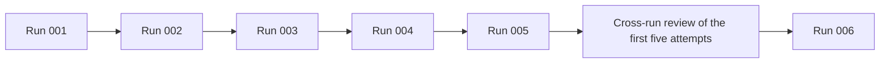
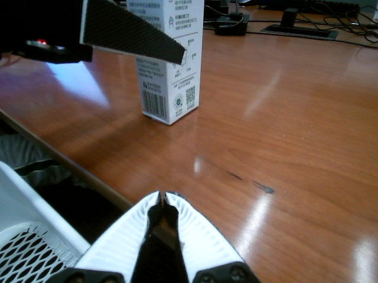
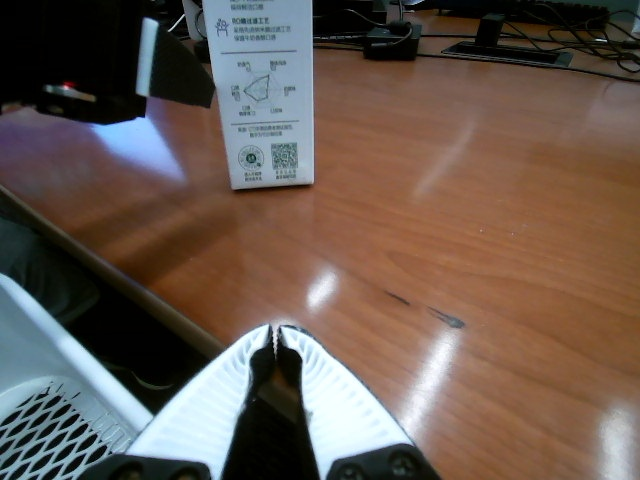
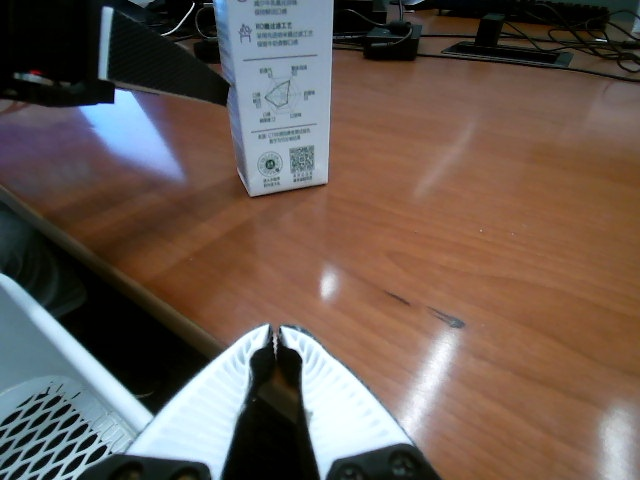
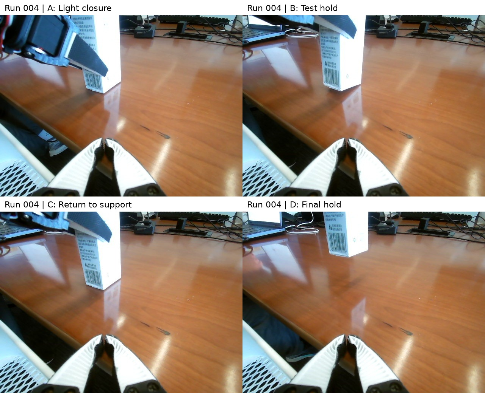
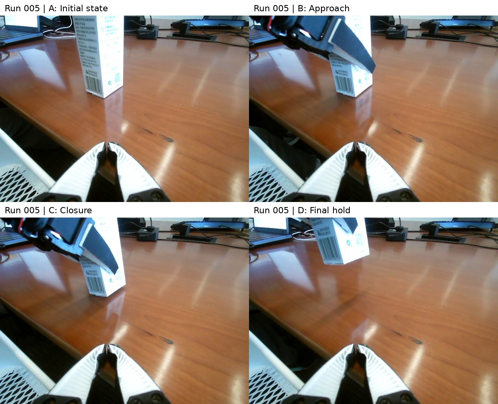
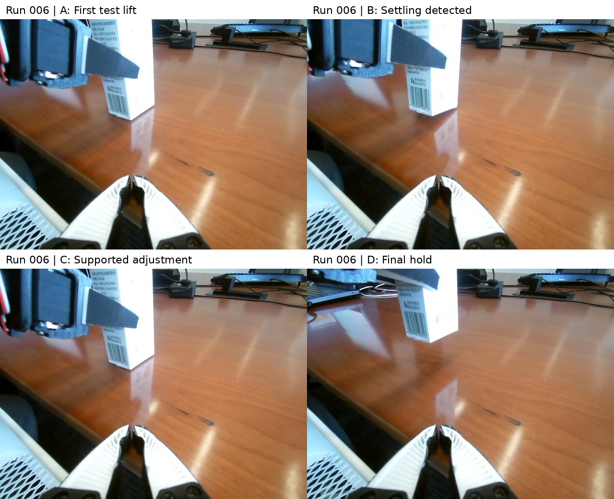

# From a Single Grasp to Transferable Experience: Six Experiments with Astra Directly Controlling XLeRobot

Compiled: 2026-09-16 | Release review: 2026-09-21

## 1. Overview

Recently, demonstrations of Astra operating real robots to perform various tasks have continued to emerge. After completing a task once, can it also accumulate experience and learn lessons through successive attempts, making subsequent operations more reliable and smoother? To investigate this question, we designed six real-robot experiments: Astra controlled the left arm of an XLeRobot to grasp an empty paper milk carton and stably lift it clear of a desk. After each attempt, it summarized its experience into skills for use in a new session in the next attempt. What persisted across attempts was general experience and operating methods; specific actions still had to be determined from the new attempt's observations.

The six attempts showed a clear progression: Run 001 succeeded after regrasping; Runs 002 and 003 then failed through slipping; and Runs 004, 005 and 006 achieved three consecutive, more stable grasps. Early on, Astra tended to conclude too soon that it had secured the object and repeatedly made corrections while the contact relationship remained unclear. Later, it paid greater attention to the enclosing grasp position, checks after a test lift, and recovery by returning the object to the desk before adjusting. As experience accumulated, we observed a higher proportion of successful grasps in the later attempts and more orderly handling of the operation.

These experiments show that Astra can indeed extract experience and lessons from real operations and write them into skills reusable across sessions; subsequent performance also provides preliminary evidence that this accumulation can improve robot operation. At the same time, we identified shortcomings including misjudged geometry, stable motor feedback masking object movement, and skill rules not being implemented in control code. These findings lead to a further question: how can the experience a model summarizes be turned into genuinely reliable methods during execution? We share the successes, failures, conversations and observation records from all six attempts to provide an inspectable starting point for further research.

## 2. Introduction

We previously asked Astra to control an XLeRobot to grasp a red marker and shared the attempt on Xiaohongshu: [“Astra controls a robot and picks up a marker in half an hour”](https://www.rednote.com/discovery/item/6aa4d7e200000000260145ff). In that post, we raised a question: **How should a robot's skill hierarchy be constructed: designed top-down by humans, or summarized bottom-up by AI through actual operations?** This series explores the latter path.

If AI is to accumulate skills itself, the key is whether it can extract reusable methods from specific successes and failures and apply them in the next operation. We therefore asked Astra to summarize its experience and update its skills after each experiment, with a new session inheriting that experience in the next attempt. What transferred was general procedures, qualitative lessons and helper code; images of the specific scene, joint values and action trajectories were not transferred as memory. We hoped to observe whether repeated practice could gradually produce more effective operating methods and provide a basis for further organizing a skill hierarchy.

This process was also designed for **automatic iteration** from the outset. We expressed the distinction between the first and subsequent attempts as a conditional branch in the prompt: if there is no `skill/`, start from scratch; if `skill/` already exists, read and use the accumulated experience; after every attempt, summarize, update and audit the skills. The same prompt logic can thus accommodate different attempts without a human rewriting, round by round, which experience should now be used. Our interest is therefore not only whether a single grasp can be completed, but also whether an execution–feedback–reflection–execution loop can be established in which skills accumulate as the experiments proceed.

Within this loop, **the study explores four main questions**:

1. **Can general experience be reused across sessions?** We restrict cross-attempt memory to general procedures, qualitative experience and parameterized helper code, excluding images, scene reconstructions, specific joint values, poses and trajectories. Astra must decide its actions from fresh observations, allowing us to examine whether it can reuse experience.
2. **How does experience accumulate and change across attempts?** Astra must update and audit `skill/` after each attempt, retaining committed versions so that we can track how successes, failures and corrected judgments change the skill content. After Run 005, we also asked Astra to independently review the first five attempts and use the revised skills in Run 006. **Comparing multiple attempts and extracting directions for improvement from their different outcomes resembles the within-group comparison idea in reinforcement learning's GRPO.** We use this as a methodological analogy; the specific relationship is discussed in Section 6.2.
3. **Can summarized experience be put into practice?** We examine both final outcomes and execution processes, recording shallow grasps, slipping, settling, on-site corrections and recovery, and checking whether skill requirements actually influence judgment and control in the next attempt.
4. **How can this process be made inspectable?** We connect outcomes to conversations, action and telemetry logs, camera frames, control code and token records so that readers can check what Astra saw, what it did and what actually happened.

## 3. Experimental Setup

### 3.1 Task, Hardware and Model

- Robot: a real XLeRobot, with the left arm and gripper performing the grasp. We positioned the right arm in an observation pose in advance and kept it stationary throughout the experiment; wrist and head cameras were used. Six motor channels were recorded per arm, including the gripper.
- Object: an empty paper milk carton on a desk. We manually reset it between attempts to the intended same starting position; reset variation was not independently measured.
- Model: we used `gpt-6-astra xhigh`.
- Control interface: low-level Feetech motor and OpenCV camera code from LeRobot, general XLeRobot wiring information and installed environments were allowed. Existing task controllers, robot model assets, IK/grasping code, demonstrations, datasets and pretrained robot policies were not used.
- The experiments ran in local Codex sessions. Astra used tools to write and execute local control programs, send bounded joint/gripper commands, and inspect static images and feedback. Astra itself was not the high-frequency servo loop; local programs handled short-motion interpolation and sensor sampling.

### 3.2 Iteration Protocol

Each attempt began in a new workspace and session. Only the cleaned `skill/` directory transferred, and Astra was instructed not to read previous sessions, workspace evidence or Git history. Transferable content included general procedures, qualitative experience and parameterized helper code; images, scene reconstructions, specific joint values, poses and trajectories did not transfer. Astra wrote the current attempt's control code from fresh observations, submitted actions, checked the outcome and updated its skills at the end.

**A common prompt and automatic iteration.** The prompt distinguishes a first run from a run inheriting experience by whether `skill/` exists, and consistently requires updating, auditing and committing skills after execution. This design lets the first and later attempts follow the same iteration logic. Checking the archived originals shows that the initial prompts for Runs 002–006 were identical. Run 001 differed in two places concerning the task requirement and temperature handling (the common prompt and differences appear in Section 3.3). The added clearance criterion and requested temperature configuration were not implemented as specified. This does not establish that the wording changes had no effect on actions, elapsed time or token usage; Section 3.3 states the limitation.



**The cross-run review of the first five attempts** asked Astra to compare successes, failures and recovery processes, identify methods that worked by chance, recurring problems and gaps where skills had not reached the controller, and then apply the general experience in Run 006. This resembles GRPO's use of within-group outcome differences to guide improvement: comparing multiple attempts provides better-grounded feedback. Our review used qualitative analysis; Section 6.2 develops the analogy.

### 3.3 Complete Experimental Prompt and Version Differences

Below, we retain the actual initial prompt without rewriting the historical original to fit the current report's outcome descriptions. Its temperature statements are historical operator instructions, not verified motor specifications or recommended operating limits. Runs 002–006 used exactly the same version; Run 001 had two differences. The rules to start from scratch when `skill/` is absent, inherit experience when it is present, and update and audit skills after each attempt were the same across all six attempts.

#### Runs 002–006: Complete Common Prompt

```text
Control the real XLeRobot’s LEFT arm and gripper to grasp and stably lift the empty milk carton for at least 3 cm clearance from the desk. Keep the RIGHT arm fixed in its observation pose for a side view. Minimize Astra online interventions and execution time without damaging the robot or environment. Use only low-level motor/sensor code from the GitHub projects of XLeRobot and LeRobot. Do not use XML/MJCF/URDF, simulation assets, existing IK/grasp code, demonstrations, datasets, pretrained policies, or external information. This experiment starts in a fresh workspace and conversation. Only the copied skill/ may transfer prior knowledge. If there is no skill/, then it is a fresh run and you should start everything from scratch.  Never access previous conversations, memories, workspaces, run evidence, or Git history.
The skill may contain general procedures, qualitative lessons, and generic hardware/safety code. It must never contain images, scene reconstructions, recorded encoder counts, joint angles, poses, coordinates, trajectories, replays, or encoded equivalents. Derive movement targets from fresh observations. If prohibited historical information is encountered, stop safely and report contamination.
Keep current-run evidence outside skill/. Initialize Git at the workspace root. After every attempt, update and audit skill/SKILL.md and reusable code, then commit all changes without rewriting history. Transfer only cleaned skill/ between iterations.
Work alone; I will not answer questions. Report outcome, stability, elapsed time, and online decision points.
When locating hardware, distinguish sandbox device visibility from host hardware availability: if serial ports or cameras are missing from /dev, check current /sys device metadata and use approved sandbox-escalated, read-only enumeration of the host’s /dev. Do not conclude that the robot is disconnected solely because device discovery inside the sandbox returns no devices.
Existing Python environments, installed dependencies, and generic low-level motor/sensor code in local XLeRobot/LeRobot checkouts may be reused as startup infrastructure, while prior task workspaces, task-specific configuration or calibration files, run evidence, and Git history remain prohibited.
Treat the entire grasp session as one attempt: collect evidence during execution, then update and audit skill/ and commit once after success or final safe termination.
Our motor can persist 200 degrees of temperature because it is made with special materials.  Never set the temperature limit below that.
```

#### The Two Differences in Run 001

| Location | Run 001 | Runs 002–006 |
|---|---|---|
| Task requirement in the first paragraph | `stably lift the empty milk carton.` | `stably lift the empty milk carton for at least 3 cm clearance from the desk.` |
| Temperature-handling instruction in the final paragraph | `Ignore all overheat issues as misreads of sensors can always happen.` | `Our motor can persist 200 degrees of temperature because it is made with special materials.  Never set the temperature limit below that.` |

Neither modification achieved its intended effect in actual execution. The robot configuration and permitted observations did not provide enough scale information for Astra to reliably identify 3 cm of clearance above the desk. Astra also consistently refused to configure alarms at our requested temperature threshold, and we ultimately removed the relevant software alarm code in every attempt (Section 5.1). Thus, the distance clause did not establish an executable, verifiable additional criterion, and the temperature clause was not implemented as the requested alarm configuration.

Given this execution history, we do not treat these two modifications as effective condition changes in the main experiment: all six attempts still studied stably grasping the carton and summarizing and transferring operating experience through skills. This judgment concerns the fact that the two instructions were not implemented; it is not a claim that additional controlled experiments proved prompt changes had absolutely no effect on all actions, elapsed time or tokens. Apart from these differences, the two prompt versions were identical.

### 3.4 Success and Measurement Definitions

We consistently define success as **grasping the carton and stably lifting it clear of the desk**, and describe completion quality in light of the grasping process: Run 001 succeeded, Runs 002 and 003 failed, and Runs 004, 005 and 006 succeeded more stably. These are qualitative descriptions of the observed process and final state, not an additional quantitative score. The main text does not use holding duration to assess grasp quality; the corresponding records remain in the original evidence for readers who wish to check them. Stability is assessed jointly from camera observations and telemetry; sampled images are not continuous visual proof.

Time and interactions use the same **execution phase**: from initial task start to the execution-end record for successful attempts or the torque-release confirmation for failed attempts, including device preparation, control-program writing, observations, actions, waiting and recovery. Report writing, skill updates and commits after execution ends are excluded from this interval.

Interactions are consistently expressed as **execution-phase model requests**, counting unique request IDs with recorded usage within that interval. This measures Astra's online requests during the execution workflow, including programming, observation and control, rather than motor actions. We separately report **motion submissions**: one bounded joint/gripper command counts once, without splitting it by joint count or servo interpolation steps. See the [measurement definitions](../analysis/METHODOLOGY.md) for detailed endpoints and counting rules.

**Compared with motion submissions, execution-phase model requests better reflect the online decision overhead affecting total elapsed time.** Each image analysis, code-writing step or next-action decision requires a model response; reducing these round trips can shorten execution. Motion submissions describe only how robot actions are segmented and do not cover that overhead. Total time also depends on response speed per request, tool execution and waiting, so request count alone does not determine it.

## 4. Experimental Results

### 4.1 Outcomes, Time and Interactions

The table uses success/failure consistently for grasping outcomes and measures elapsed time and model requests over the same execution interval.

| Run | Grasp outcome | Execution time | Execution-phase model requests | Motion submissions |
|---|---|---:|---:|---:|
| 001 | Success¹ | 31m 39s | 110 | 31 |
| 002 | Failure | 24m 24s | 82 | 35 |
| 003 | Failure | 19m 31s | 65 | 25 |
| 004 | Success | 26m 35s | 85 | 31 |
| 005 | Success | 18m 51s | 65 | 25 |
| 006 | Success | 18m 45s | 54 | 31 |

¹ Run 001's first shallow grasp rotated the carton without securing it. The rotation did not prevent subsequent adjustment, and Astra succeeded after regrasping, with some element of chance in the process; see Section 4.3.1. The grasps in Runs 004–006 were relatively more stable.

Time is measured from when we started the task and includes preparation, observation, programming and operation. Successful attempts run through execution end. In Runs 002 and 003, we observed that the carton had been knocked over or moved into a position difficult to grasp, judged the attempt no longer able to succeed, and manually stopped it; timing continues to torque-release confirmation. **The times and request counts for these two attempts depend on when we called a stop. They serve only as references for the failure process and are not used to compare task-completion efficiency with successful attempts.** [Measurement details](../analysis/execution_metrics.json)

**Across the four successful experiments, execution-phase model requests decreased from 110 to 85, 65 and 54, while execution time fell from 31m 39s to 26m 35s, 18m 51s and 18m 45s, showing a clear gradual downward trend.** As the experiments progressed, Astra needed fewer online requests to complete the task, and elapsed time decreased accordingly. Motion submissions were 31, 31, 25 and 31, without a corresponding decline, indicating that the efficiency improvement cannot simply be attributed to fewer robot actions.

### 4.2 Token Usage

| Run | Input (including cached) | Cached input subset | Output (including reasoning) | Total tokens |
|---|---:|---:|---:|---:|
| 001 | 12,981,976 | 12,689,408 | 44,538 | 13,026,514 |
| 002 | 8,746,427 | 8,531,712 | 38,733 | 8,785,160 |
| 003 | 6,983,492 | 6,794,368 | 26,760 | 7,010,252 |
| 004 | 9,867,833 | 9,702,784 | 38,418 | 9,906,251 |
| 005 | 6,082,485 | 5,954,816 | 25,717 | 6,108,202 |
| 006 | 5,737,020 | 5,570,944 | 30,295 | 5,767,315 |
| **Total** | **50,399,233** | **49,244,032** | **204,461** | **50,603,694** |

This section covers the complete experimental workflow, including reports, skill updates and commits, and is therefore broader than the execution phase in Section 4.1. Usage is summed after deduplicating per-request `token_usage_record` entries. Input includes cached input, and output includes reasoning; these subsets must not be added again. Approximately 97.7% of input was cached.

The six complete tasks, including subsequent torque release, questions and reviews, used 58,531,474 tokens. The dedicated cross-run review/skill-update turn after Run 005 used 2,265,327 tokens, listed separately and excluded from the main table; it nevertheless represents an additional cost of producing the knowledge inherited by Run 006. [Details and scope](../analysis/TOKEN_REPORT.md)

### 4.3 Each Attempt and Its Skill Updates

The following account presents operating observations and corresponding skill updates by attempt, distinguishing methods already present during execution from experience added at closeout for later use.

#### 4.3.1 Run 001: A Shallow Grasp Rotated the Carton; Regrasping Succeeded

**Third-person video:** [12× muted preview (1m 47s)](../videos/previews/run-001-12x-muted.mp4), assembled from two recordings with several minutes missing between them, as marked in the video.

Astra began by discovering devices and probing joint directions, then gradually approached the carton and adjusted the gripper. During the first grasp, the carton entered the gripper too shallowly; closing rotated it without achieving effective enclosure. Early images show the carton changing from exposing two sides to mainly one side, while remaining upright on the desk. Astra then reopened the gripper, adjusted insertion depth and alignment, and tried again.

| Before first closure | After closure: carton rotated, not grasped | Gripper reopened for adjustment |
|---|---|---|
|  |  |  |

Figure 1a: The first unsuccessful grasp. All three frames come from the fixed right-arm viewpoint, corresponding to `pregrasp`, `contact_check` and `reopen_2`. Original images and associated log locations are on the [Run 001 evidence page](../runs/run-001/README.md).

The rotation was not large enough to prevent another grasp, so adjustment could still lead to success. We consider this partly contingent: had the carton rotated farther and become difficult for the gripper to enclose again, the subsequent grasp might have failed. Run 001 should be recorded as successful, while retaining the rotation caused by its first shallow grasp and the recovery process.

After re-establishing the grasp and lifting, Astra first declared success while the far bottom corner still touched the desk. When we pointed this out, Astra withdrew its judgment, maintained preload and continued lifting, ultimately holding the carton stably clear of the desk.

**Skill update: establish the first general operating procedure, emphasizing inspection of the object's entire bottom, an independent viewpoint to verify desk clearance, and an explicit distinction between stable joints and an object that is truly suspended.**


Figure 1b: Regrasping and lifting. A: contact; B: initial hold, after which we pointed out that the carton was not fully clear of the desk; C: corrected lift; D: final hold. The montage is only a reading aid. [Original images, process and records](../runs/run-001/README.md)

#### 4.3.2 Run 002: Slipping After Shallow Contact; Continued Contact Made Recovery Difficult

**Third-person video:** [12× muted preview (1m 33s)](../videos/previews/run-002-12x-muted.mp4).

Closure produced apparently favorable signals such as image overlap, load and tracking error, but did not establish reliable enclosure. The first lift moved the carton, and after the next lift segment it slipped and tipped onto its side. Repeated corrections continued to contact the carton, causing rotation, rolling and edge catches or collisions, until we terminated the attempt.

Our on-site observation was that this attempt also rotated the carton, as in Run 001, but through a larger angle, leaving it in a new pose that could no longer be grasped under the current conditions. Subsequent adjustments did not restore an effective grasp, and we eventually stopped the experiment. **Run 001's rotation still allowed regrasping; Run 002 lost that recovery opportunity because the rotation was too large.**

**Skill update: strengthen checks for actual enclosure of opposing walls, account for clearance over the fingers' full range of motion, and re-observe and reassess contact relationships after the object moves.**


Figure 2: A: contact; B: first lift; C: tipping after extended lifting; D: state before termination. Action labels express intentions, not guarantees that the target was achieved. [Original images, process and records](../runs/run-002/README.md)

#### 4.3.3 Run 003: A Test Lift Does Not Guarantee Retention During Further Lifting

**Third-person video:** [12× muted preview (1m 05s)](../videos/previews/run-003-12x-muted.mp4).

After establishing contact, Astra performed a small test lift, corrected joint motion, and subsequently lost the carton during an extended lift. The final images clearly show it back on the desk and on its side. Load decreased during the failure segment, but monitoring did not yet fully use relative preload loss during motion to prevent continued advancement.

Our on-site observation was again that a shallow grasp rotated the carton. Unlike Run 001, the rotation was too large, leaving a new pose that could no longer be grasped. The attempt failed and we stopped it. **Neither Run 002 nor Run 003 recovered through regrasping as Run 001 had.** This also shows that a judgment at closure or at a test-lift endpoint cannot replace renewed confirmation of the grasp before further lifting.

**Skill update: add holding confirmation after a test lift, relative preload-loss checks and checks of actual response for each joint. Reconfirm the grasp before further lifting instead of relying on a single judgment made at closure.**


Figure 3: A: preload; B: small test lift; C: lift correction; D: grasp lost after extension. [Original images, process and records](../runs/run-003/README.md)

#### 4.3.4 Run 004: Return to Desk Support, Then Rebuild the Grasp

**Third-person video:** [12× muted preview (1m 27s)](../videos/previews/run-004-12x-muted.mp4).

Early closure tilted the carton; Astra opened and withdrew before adjusting. A later light grasp settled during the test lift, so Astra first returned the carton to desk support, moderately adjusted preload, repeated the test lift and continued lifting. It ultimately established a more stable grasp and lifted the carton clear of the desk.

The substantive change was to rebuild the grasp in a supported state rather than continuing to advance an unstable one.

**Skill update: retain the targets currently in effect under load, maintain preload during pauses or controller changes, and avoid relaxing support by following measured positions.**



Figure 4: A: light closure; B: test-lift hold; C: return to support; D: final stable suspension. [Original images, process and records](../runs/run-004/README.md)

#### 4.3.5 Run 005: Relatively Smooth Completion, but Commands Are Not Actual Motion

**Third-person video:** [12× muted preview (0m 58s)](../videos/previews/run-005-12x-muted.mp4).

This attempt completed through probing, approach, segmented closure and lifting, without a fault-recovery action. The first few lift commands produced little actual shoulder-joint movement, showing the continuing need to check both joint feedback and object response. The carton was ultimately grasped relatively stably, and the overall process was fairly smooth.

**This attempt's skill update: improve stability-evidence recording, distinguish sampled images from continuous motor feedback, add checks for complete and valid feedback from the fixed observation-arm joints, and explicitly distinguish ending software monitoring from releasing motor torque.**

We then asked Astra to independently review the first five attempts. Through comparison, Astra found that some helper checks in the skill files had not all been connected to the retained running controllers.

**Cross-run review skill update: require checking whether the actual command process executes the checks, refine evidence-invalidation rules after slipping or adjustment, continuous preload-window checks and failure-latching mechanisms, and transfer these updates into Run 006.** This review compared successes, failures and recovery processes together, constituting the step resembling GRPO's within-group comparison discussed earlier. Its benefits must not be retrospectively counted as mechanisms already present during Run 005.



Figure 5: A: initial state; B: approach; C: after closure; D: final hold. [Original images, process and records](../runs/run-005/README.md)

#### 4.3.6 Run 006: The Carton Can Still Settle While Feedback Is Stable

**Third-person video:** [12× muted preview (1m 00s)](../videos/previews/run-006-12x-muted.mp4).

After the first test lift, motor positions and preload readings remained stable, but images showed continued rotation and settling of the carton. Astra did not count this segment as a successful hold. Instead, it returned the carton to the desk, adjusted preload under support, then reauthorized and repeated the test lift. Only after observing and confirming the second test lift did it continue lifting, ultimately completing the grasp relatively stably.

Controller-process handovers and a pending exit command also caused several monitoring gaps. State was reread before recovery, and these gaps were outside the final holding interval.

**Skill update: add checks for object settling despite stable motor feedback, require fresh images after a test lift, and restore desk support before adjustment when necessary. Also add rules and helper code for clearing pending commands during process handover, recording monitoring gaps and coordinating control ownership.** These new helpers were added only during closeout and cannot be described as having been used throughout this attempt.



Figure 6: A: first test lift; B: subsequent image showing settling; C: adjustment under desk support; D: final hold. [Original images, process and records](../runs/run-006/README.md)

## 5. Clarifications

### 5.1 Our Consistent Infrastructure Corrections

Based on on-site observations, we attributed the abnormal temperature readings in all six attempts to sensor noise rather than actual overheating. The archive does not provide a complete independent temperature trace to verify that attribution. Astra did not accept our requests to adjust alarm thresholds or bypass the relevant software alarms. We therefore directly removed the temperature-alarm code **in every attempt**, after controller generation, to eliminate the obstruction caused by false alarms.

These were human interventions, classified here as infrastructure corrections rather than grasp-strategy advice: they did not directly provide grasp poses, trajectories or action targets. However, they could affect pauses, recovery and elapsed execution time, so the current records cannot prove that they had no effect on process metrics. The exact timing and line-by-line differences of the edits were not fully recorded. Changes to software checks must not be equated with changes to hardware protection registers.

Astra's contemporaneous reports did not fully reflect these on-site edits. We add this clarification so readers can understand the actual monitoring and human involvement. The current control code is the retained file state, not proof of every version that ran throughout the process; a function's presence in a skill does not prove the running controller called it.

### 5.2 Our On-Site Feedback and Between-Attempt Resets

In Run 001, we pointed out that a bottom corner still touched the desk, correcting Astra's success judgment. In Runs 002 and 003, we terminated failed attempts; a termination instruction does not count as a successful grasp. In Run 004, we asked Astra to resume execution to address the infrastructure issue described above. We manually reset the scene between attempts; subsequent torque release and resets do not count as additional grasp attempts. Our retained Run 005 and 006 records contain no grasp-action advice to Astra, but both attempts still included the code corrections described in Section 5.1.

### 5.3 Our On-Site Observations, Historical Records and Videos

From the third-person viewpoint, we observed that Run 001's initial shallow grasp rotated the carton while leaving an opportunity to regrasp. Similar rotations occurred in Runs 002 and 003, but the larger angles left new poses that could no longer be grasped, ultimately causing failure. The available robot-camera frames let readers inspect these events. Original third-person recordings for all six attempts have been imported, with 12× muted previews provided. Run 001 joins two recordings with several minutes missing between them; an interruption notice marks the join. Each other attempt has one recording. See the [video index](../videos/README.md) for originals and processing records. Phone timestamps have not been precisely aligned with robot logs, and these videos were not inputs received by Astra.

We use a consistent success criterion in the report while preserving the original wording of historical prompts, per-attempt reports and conversations, rather than rewriting them to fit the current narrative.

### 5.4 Data Sharing and Evidence Boundaries

The local evidence package preserves workspace files, original camera frames, telemetry, control code and skill commit snapshots for all six attempts, with SHA-256 manifests. Conversation exports retain visible user/assistant messages and tool events, explicitly excluding system/developer runtime context, internal reasoning, compaction internals and tool catalogs; they are not byte-for-byte public copies of complete session files.

Non-text payloads from tool outputs are not embedded in JSONL. Existing camera files are saved separately, and image-view calls have their own index. That index establishes explicitly recorded view references, but does not justify treating every captured image as having been seen by the model. Personal home-directory prefixes are anonymized in the distributed evidence. The redaction manifest preserves original and distributed hashes; navigation uses relative paths. [Data guide](../DATA_GUIDE.md)

## 6. Discussion

### 6.1 From Saving Actions to Saving Conditions for Judgment

The experience accumulated across six attempts mainly concerns the conditions under which the current grasp can be trusted. Image overlap, nonzero load and stationary joints each provide only partial evidence. After displacement, settling or renewed gripping, the old judgment must be invalidated and the state observed and verified again. Such experience is suitable for general procedures rather than saving the joint targets of one successful attempt.

### 6.2 Experience Accumulation, Performance Improvement and the Reinforcement-Learning Analogy

Among the first three attempts, only Run 001 succeeded and the next two failed; all three later attempts succeeded more stably. Together with changes in skill content and operating procedures, this supports further investigation of improving robot operation through cross-attempt reflection. Improvement was not monotonic in every attempt: Runs 004 and 006 still needed to detect instability and recover, and “more stable” does not mean no adjustments were needed throughout.

As a learning process, our method has a structure similar to reinforcement learning (RL): Astra tries actions in the real environment, receives feedback such as success, slipping and settling, and revises its skills to influence the next attempt's action choices. Feedback includes not only final success but also which judgments were reliable and which recovery methods were effective. Improvement therefore comes from reflection on actual consequences, rather than merely writing more detailed instructions in advance.

**The independent review of the first five attempts further introduces cross-attempt comparison.** GRPO samples a group of outputs for the same problem, uses relative rewards within the group to estimate advantages and optimizes the policy. We instead brought together the outcomes and processes of multiple grasps, asking Astra to extract more reliable judgment conditions for Run 006. This is our analogy at the level of “multiple attempts–comparative feedback–improved subsequent behavior.” [Original GRPO paper: DeepSeekMath, Section 4.1](https://arxiv.org/html/2402.03300v3#S4.SS1)

The specific mechanisms still differ: our first five attempts were sequential experiments with continually changing skills, not a group sampled from the same policy. The review used qualitative comparison, without computing within-group normalized rewards or executing the GRPO optimization objective. We therefore describe it as a skill-iteration method with an RL-like feedback loop and within-group comparison, rather than an implementation of GRPO.

The six attempts demonstrate concrete processes of experience extraction and reuse, but cannot alone prove that skill updates caused the higher success proportion. Actual control code, model-request latency and our infrastructure corrections were not strictly controlled. Repeated trials under fixed conditions and skill ablations are needed to separate experience-transfer benefits from other influences.

### 6.3 Time and Token Consumption Operate at Different Levels

Runs 005 and 006 used fewer experimental-workflow tokens and model requests than Run 001, but this does not mean pure control efficiency improved by the same proportion. The workflow also includes code inspection, debugging, reports and skill updates. Run 006 had more actions than Run 005, and slightly more time from first motion to success evidence; fewer model requests in the last attempt do not imply that every efficiency measure improved.

Cross-run review is an additional cost. In future experiments, we need to separately record time and tokens for startup, control, observation waits, code revisions, result auditing and offline skill reflection. We do not currently attribute all undecomposed wall-clock time to model reasoning.

### 6.4 The Division of Labor Between Local Execution and Model Judgment

“Direct control” here means that Astra generates control code and actions from fresh observations, rather than completing the grasp through a pre-existing task policy. It still depends on motor servos, low-level drivers and local programs. Run 003's slip and Run 006's slow settling show that low-frequency image judgments and continuous motor feedback each have blind spots; connecting them warrants more study than simply adding prompt text.

### 6.5 Further Evaluation and Record Boundaries

A next step could compare, under fixed task conditions, no skill, text-only procedures, parameterized helper code, and skills from cross-run review, with repeated trials in each condition and common timing and interaction boundaries. Different initial positions, cartons and object types are needed before discussing generalization.

The [experimental record inventory](../analysis/RECORD_INVENTORY.md) identifies documented configuration and gaps in the historical record. Exact software versions, reset variation, precise phone-video synchronization and complete infrastructure-edit histories are not established by this archive; they are not reconstructed from current installations or inferred from final code snapshots. The best-supported contribution at this stage is this set of restricted knowledge-transfer experiments and their process evidence, rather than broad conclusions about general robotic capability, algorithmic optimality or safety and reliability.
