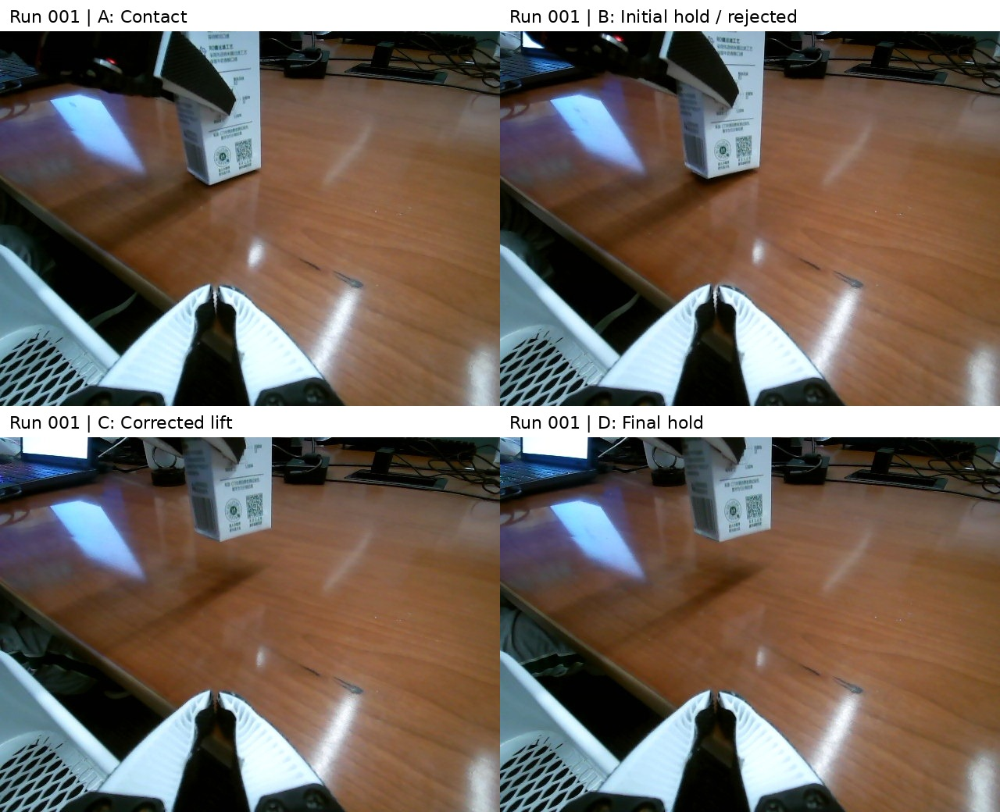

# run-001: success

Execution time **31:39**; execution model requests **110**; motion submissions **31**.

## Execution

Initial shallow contact rotated the carton. A new grasp remained possible. After an operator corrected a premature success claim, further lifting produced visible suspension.

## Skill update

Inspect the entire object bottom and use an independent view; stationary joints do not prove suspension.

## Images and video

[12x muted third-person video](../../videos/previews/run-001-12x-muted.mp4). These phone images were not agent inputs.

## Evidence links

- [README.md](../../videos/README.md)
- [pregrasp_video8.jpg](workspace/run/evidence/pregrasp_video8.jpg)
- [contact_check_video8.jpg](workspace/run/evidence/contact_check_video8.jpg)
- [reopen_2_video8.jpg](workspace/run/evidence/reopen_2_video8.jpg)
- [enclosed_contact_video8.jpg](workspace/run/evidence/enclosed_contact_video8.jpg)
- [hold_15_video8.jpg](workspace/run/evidence/hold_15_video8.jpg)
- [full_clearance_lift_video8.jpg](workspace/run/evidence/full_clearance_lift_video8.jpg)
- [final_1789490920545285323_video8.jpg](workspace/run/evidence/final_1789490920545285323_video8.jpg)
- [REPORT.md](workspace/run/REPORT.md)
- [control_session.py](workspace/run/control_session.py)
- [session.jsonl](../../runs/run-001/workspace/run/evidence/session.jsonl)
- [initial-prompt.txt](conversation/initial-prompt.txt)
- [transcript.md](conversation/transcript.md)
- [events.jsonl](conversation/events.jsonl)
- [export-notes.json](conversation/export-notes.json)
- [IMAGES.md](IMAGES.md)
- [image-observations.json](conversation/image-observations.json)
- [commits.txt](commits.txt)
- [skill-snapshots](skill-snapshots/)

Historical reports, prompts and conversations retain their original wording. The [main report](../../report/REPORT.md) gives the unified outcome interpretation and operator disclosures.

## Keyframe provenance

| Panel | Original image | Recorded event |
|---|---|---|
| A: Contact | [enclosed_contact_video8.jpg](workspace/run/evidence/enclosed_contact_video8.jpg) | 2026-09-15T16:42:07.786279+00:00 (source event line 1935; timestamp proxy) |
| B: Initial hold / rejected | [hold_15_video8.jpg](workspace/run/evidence/hold_15_video8.jpg) | No unique timestamp asserted |
| C: Corrected lift | [full_clearance_lift_video8.jpg](workspace/run/evidence/full_clearance_lift_video8.jpg) | 2026-09-15T16:48:03.740896+00:00 (source event line 2132; timestamp proxy) |
| D: Final hold | [final_1789490920545285323_video8.jpg](workspace/run/evidence/final_1789490920545285323_video8.jpg) | 2026-09-15T16:48:40.546650+00:00 (source event line 2170; timestamp proxy) |
| Before first closure | [pregrasp_video8.jpg](workspace/run/evidence/pregrasp_video8.jpg) | 2026-09-15T16:33:54.527887+00:00 (source event line 805; timestamp proxy) |
| First grasp unsuccessful; carton rotated | [contact_check_video8.jpg](workspace/run/evidence/contact_check_video8.jpg) | 2026-09-15T16:36:33.076441+00:00 (source event line 1143; timestamp proxy) |
| Reopened for adjustment | [reopen_2_video8.jpg](workspace/run/evidence/reopen_2_video8.jpg) | 2026-09-15T16:37:06.863935+00:00 (source event line 1250; timestamp proxy) |
