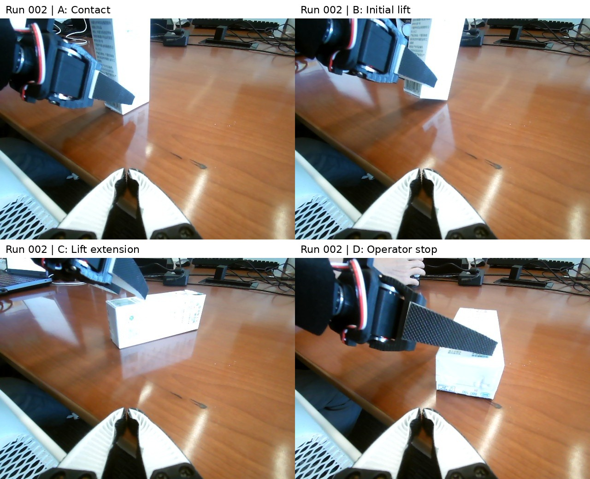

# run-002: failure

Execution time **24:24**; execution model requests **82**; motion submissions **35**.

## Execution

Shallow enclosure was followed by slip and excessive rotation. Continued contact complicated recovery. The operator terminated the attempt after the carton reached an unfavorable pose.

## Skill update

Verify opposing-wall enclosure, full finger-sweep clearance and renewed evidence after object motion.

## Images and video

[12x muted third-person video](../../videos/previews/run-002-12x-muted.mp4). These phone images were not agent inputs.

## Evidence links

- [README.md](../../videos/README.md)
- [secure_contact_video8.jpg](workspace/evidence/secure_contact_video8.jpg)
- [initial_lift_video8.jpg](workspace/evidence/initial_lift_video8.jpg)
- [clearance_lift_video8.jpg](workspace/evidence/clearance_lift_video8.jpg)
- [operator_stop_video8.jpg](workspace/evidence/operator_stop_video8.jpg)
- [RUN_REPORT.md](workspace/RUN_REPORT.md)
- [control.py](workspace/run/control.py)
- [control.jsonl](../../runs/run-002/workspace/evidence/control.jsonl)
- [initial-prompt.txt](conversation/initial-prompt.txt)
- [transcript.md](conversation/transcript.md)
- [events.jsonl](conversation/events.jsonl)
- [export-notes.json](conversation/export-notes.json)
- [IMAGES.md](IMAGES.md)
- [image-observations.json](conversation/image-observations.json)
- [commits.txt](commits.txt)
- [skill-snapshots](skill-snapshots/)

Historical reports, prompts and conversations retain their original wording. The [main report](../../report/REPORT.md) gives the unified outcome interpretation and operator disclosures.

## Keyframe provenance

| Panel | Original image | Recorded event |
|---|---|---|
| A: Contact | [secure_contact_video8.jpg](workspace/evidence/secure_contact_video8.jpg) | 2026-09-16T00:49:40.653247+00:00 (source event line 1475; timestamp proxy) |
| B: Initial lift | [initial_lift_video8.jpg](workspace/evidence/initial_lift_video8.jpg) | 2026-09-16T00:50:26.983468+00:00 (source event line 1580; timestamp proxy) |
| C: Lift extension | [clearance_lift_video8.jpg](workspace/evidence/clearance_lift_video8.jpg) | 2026-09-16T00:50:55.816857+00:00 (source event line 1677; timestamp proxy) |
| D: Operator stop | [operator_stop_video8.jpg](workspace/evidence/operator_stop_video8.jpg) | No unique timestamp asserted |
