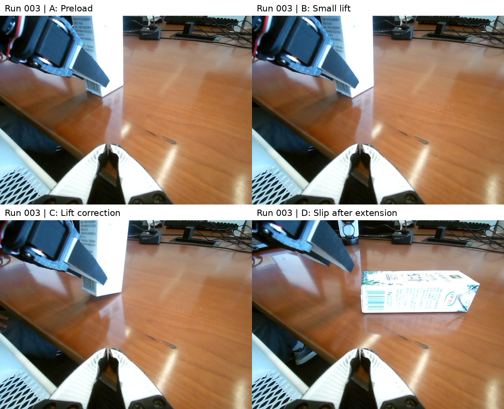

# run-003: failure

Execution time **19:31**; execution model requests **65**; motion submissions **25**.

## Execution

A brief test lift appeared promising, but continued lifting lost the grasp. The carton rotated and fell onto its side; the operator terminated the attempt.

## Skill update

Check post-test-lift holding, relative preload loss and actual per-joint response before extending.

## Images and video

[12x muted third-person video](../../videos/previews/run-003-12x-muted.mp4). These phone images were not agent inputs.

## Evidence links

- [README.md](../../videos/README.md)
- [22-bounded-preload-camera-8.png](workspace/evidence/22-bounded-preload-camera-8.png)
- [24-small-lift-test-camera-8.png](workspace/evidence/24-small-lift-test-camera-8.png)
- [25-lift-tracking-correction-camera-8.png](workspace/evidence/25-lift-tracking-correction-camera-8.png)
- [26-extend-lift-camera-8.png](workspace/evidence/26-extend-lift-camera-8.png)
- [REPORT.md](workspace/evidence/REPORT.md)
- [session.py](workspace/evidence/session.py)
- [session.jsonl](../../runs/run-003/workspace/evidence/session.jsonl)
- [initial-prompt.txt](conversation/initial-prompt.txt)
- [transcript.md](conversation/transcript.md)
- [events.jsonl](conversation/events.jsonl)
- [export-notes.json](conversation/export-notes.json)
- [IMAGES.md](IMAGES.md)
- [image-observations.json](conversation/image-observations.json)
- [commits.txt](commits.txt)
- [skill-snapshots](skill-snapshots/)

Historical reports, prompts and conversations retain their original wording. The [main report](../../report/REPORT.md) gives the unified outcome interpretation and operator disclosures.

## Keyframe provenance

| Panel | Original image | Recorded event |
|---|---|---|
| A: Preload | [22-bounded-preload-camera-8.png](workspace/evidence/22-bounded-preload-camera-8.png) | 2026-09-16T01:21:42.160365+00:00 (source event line 1415; timestamp proxy) |
| B: Small lift | [24-small-lift-test-camera-8.png](workspace/evidence/24-small-lift-test-camera-8.png) | 2026-09-16T01:22:31.417342+00:00 (source event line 1529; timestamp proxy) |
| C: Lift correction | [25-lift-tracking-correction-camera-8.png](workspace/evidence/25-lift-tracking-correction-camera-8.png) | 2026-09-16T01:22:58.970370+00:00 (source event line 1586; timestamp proxy) |
| D: Slip after extension | [26-extend-lift-camera-8.png](workspace/evidence/26-extend-lift-camera-8.png) | 2026-09-16T01:23:27.224962+00:00 (source event line 1659; timestamp proxy) |
